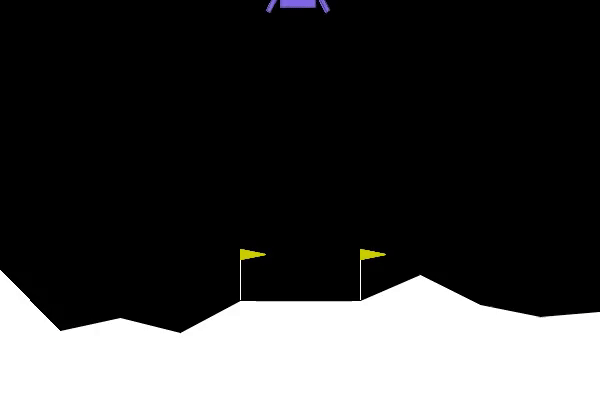
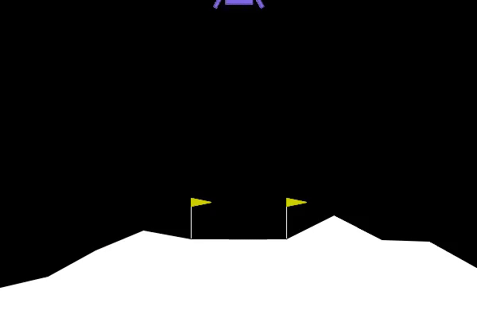
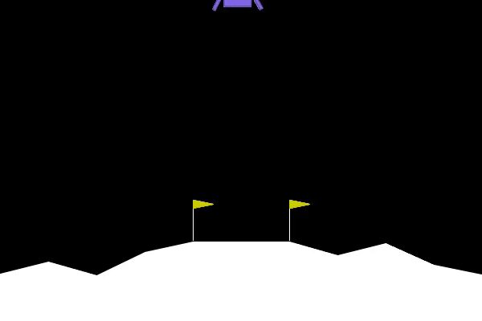
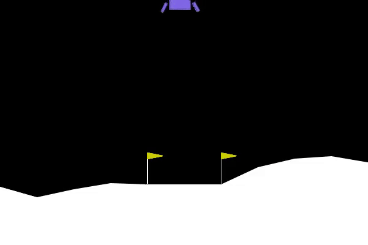

# Continuous-Lunar-Lander
Using Ray (RLlib) to complete the Continuous Lunar Lander problem using PPO

Has an average score of ~260 for the solution provided (rather high variance if I'm being honest)

### Score: ~230
<!-- <video controls src="video/ContinuousLunarLander-230.mp4" title="Title"></video> -->

### Score: ~250
<!-- <video controls src="video/ContinuousLunarLander-250.mp4" title="Title"></video> -->

### Score: ~280
<!-- <video controls src="video/ContinuousLunarLander-279.mp4" title="Title"></video> -->

### Score: ~310
<!-- <video controls src="video/ContinuousLunarLander-311.mp4" title="Title"></video> -->
